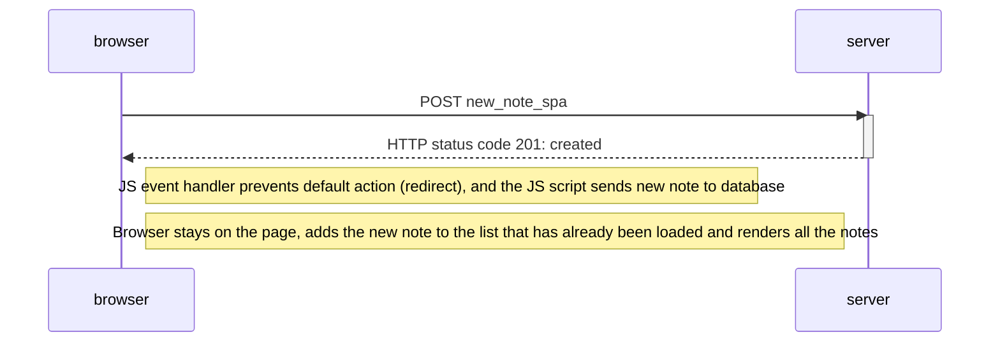

```mermaid
sequenceDiagram
    participant browser
    participant server

    browser->>server: POST new_note_spa
    activate server
    server-->>browser: HTTP status code 201: created
    deactivate server

    Note right of browser: JS event handler prevents default action (redirect), and the JS script sends new note to database
    Note right of browser: Browser stays on the page, adds the new note to the list that has already been loaded and renders all the notes

```
